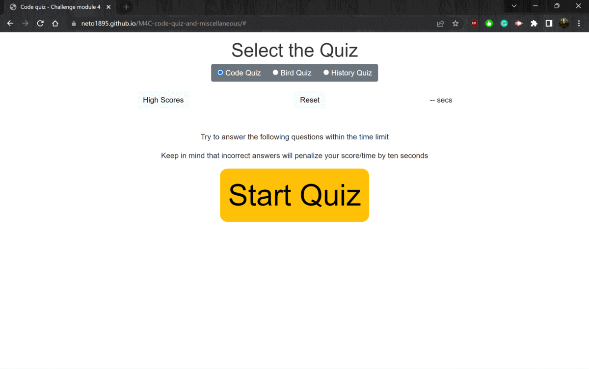

# Module 3 Challenge [Bootcamp Web Developer]

## Description

This repo contains the challenge 4 for the bootcamp of Web Developer.
This is a quiz page that can be selected the theme quiz by setting the toggle on top. This page stores the user unsername and score in the local storage. 

## Deployed application 

(https://neto1895.github.io/M4C-code-quiz-and-miscellaneous/#)

The following image shows the application first look and functionality.

## Usage

To use this page you can click at button "Start quiz" and follow the page instructions. 
This page can be used multiple times without the need of refreshing it and stores the score of the user.
Click the reset button to stop the quiz and get back to the initial state of the page. 

## Installation

N/A

## Credits

This code is made by Ernesto Cruz.

## License

N/A

